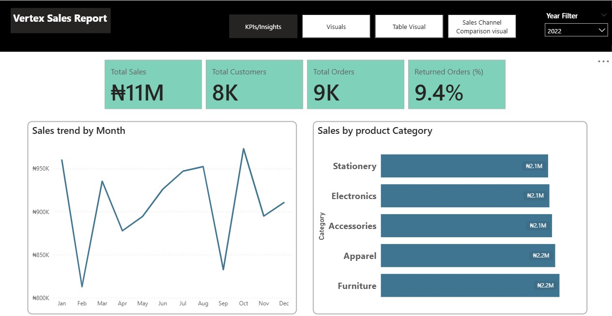
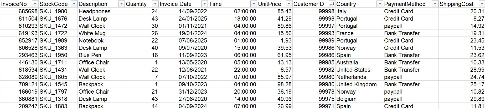

# vertex-mart-sales-report (Jan-Dec 2025)
this is a power bi report  project conducted on vertex mart sales to give insight into the business performance, profit and there customer behavior 

## Dash Board

## Executive Summary
In today's competitive retail landscape, organizations must leverage data-driven insights to improve operational performance, maximize profitability, and enhance customer satisfaction. This project focuses on the development of an interactive Sales Analytics Dashboard using Microsoft Power BI to analyze Vertex Mart's transactional sales data and uncover actionable business insights.
The dashboard was designed to provide management with a centralized view of key performance indicators (KPIs), sales trends, customer purchasing behavior, regional performance, and product profitability. Through effective data modeling, transformation, visualization, and analytical techniques, the project converts complex sales data into meaningful business intelligence that supports strategic decision-making.
The analysis revealed significant variations in sales performance across product categories, customer segments, and geographic regions. Additionally, key revenue drivers, profitability opportunities, and operational improvement areas were identified, enabling stakeholders to make informed decisions aimed at improving business growth and efficiency.

## Business Problem
Retail businesses generate large volumes of transactional data daily; however, raw data alone provides limited value without effective analysis and visualization. Vertex Mart required a business intelligence solution capable of transforming dispersed sales data into a structured reporting environment that would enable management to monitor business performance in real time.

The organization faced several analytical challenges such as:

1·   	Limited visibility into overall sales performance.

2·   	Difficulty identifying top-performing products and categories.

3·   	Inability to effectively monitor profitability across business segments.

4·   	Lack of insight into customer purchasing patterns.

5·   	Challenges in tracking regional sales performance.

6·   	Limited access to consolidated performance reporting for strategic planning.

## Methodology

The project followed a structured Business Intelligence workflow consisting of the following stages:

## 1. Data Collection
The Vertex Mart Sales Dataset served as the primary source of information, containing transactional records related to sales, products, customers, regions, and profitability metrics.
The dataset also contains detailed transactional sales records generated from the company’s retail and e-commerce operations and further consists of 49,782 rows, 16 columns. The dataset also contains transactional data across 11 different product categories in the regions and countries the company operates.

## 2. Data Cleaning and Transformation
Data preparation activities were performed to ensure analytical accuracy and reporting reliability using power bi, power query and dax.

The preparation process included:

1·   	Reviewing data completeness.

2·   	Identifying and handling null or missing values.

3·   	Removing duplicate records.

4·   	Standardizing data formats.

5·   	Correcting inconsistencies.

6·   	Validating numerical and categorical fields.

7·   	Transforming raw data into analysis-ready structures.

8.    A sales amount column was introduced to calculate transaction revenue

Power Query  was utilized to automate transformation processes and improve data quality.

## 4. Data Modeling

A relational data model was established within Power BI to optimize analytical performance.
The model incorporated:

1·   	Fact tables containing transactional sales data.

2·   	Dimension tables containing customer, product, regional, and date information.

3·   	Relationships designed to support accurate filtering and aggregation.

This structure improved reporting efficiency and enabled advanced analytical capabilities.

## 5. KPIs

Several business-critical performance measures were created using Data Analysis Expressions (DAX), including:

1·   	Total Sales

2·   	Total Orders

3·   	Total Customers

4·   	Returned Orders

These measures served as the foundation for performance monitoring throughout the dashboard.

## Data Preview

## 6. Dashboard Visualization

Interactive visualizations were developed to facilitate intuitive data exploration and executive reporting.
Dashboard components included:

1·   	KPI Cards

2·   	Sales Trend Charts

3·   	Product Performance Visualizations

4·   	Regional Analysis Reports

5·   	Customer Segment Analysis

6·   	Interactive Filters and Slicers

## Analysis and Insights

## Sales

- Analysis indicates that sales performance is influenced by multiple factors including product category, customer segment, regional demand, and purchasing behavior.

- Sales was consistent within the period of 2020-2024 and dropped in 2025 with a margin of 30% while orders, within the year under review was 48000 and returned order rate was 10.1%

- Monitoring sales trends enables management to identify periods of growth, seasonal fluctuations, and potential revenue risks.

## Product Performance Analysis and Insight

- Product-level analysis revealed that sales contributions are not evenly distributed across the product portfolio. Certain products and categories consistently outperform others, generating a disproportionate share of overall revenue and profit.

- A relatively small group of high-performing products serves as the primary driver of business revenue.
Strategic focus should be directed toward maintaining inventory availability, promotional activities, and customer engagement for high-performing product categories.

## Customer Behavior Analysis and Insight

- Customer segmentation analysis provides visibility into purchasing patterns across various customer groups.The dashboard highlights differences in spending behavior, transaction frequency, and revenue contribution among customer segments.

- Certain customer groups generate significantly higher revenue and profitability than others.

- Retention initiatives and personalized marketing campaigns should focus on high-value customer segments to maximize customer lifetime value.

## Regional Sales Analysis and Insight

- Geographic analysis reveals measurable differences in sales performance across regions. Some regions consistently outperform others in revenue generation and profitability.

- Regional disparities may indicate differences in market penetration, customer demand, competitive intensity, or operational effectiveness.

- Management should investigate underperforming regions while replicating successful strategies from top-performing locations.

## Profit Analysis and Insight

- Revenue growth alone does not guarantee business success. Therefore, profitability analysis was conducted to assess the financial efficiency of sales activities.

- Certain products generate substantial revenue but contribute relatively low profit margins.

- Decision-makers should balance revenue growth objectives with profitability optimization strategies.

## Strategic Recommendations

Based on the findings from the analysis, the following recommendations are proposed:

1. Prioritize High-Performing Products
Increase marketing investment, inventory allocation, and promotional efforts for products that consistently generate strong sales and profitability for increased revenue generation and improved market competitiveness.

2. Strengthen Customer Retention Programs
Develop loyalty initiatives and targeted campaigns aimed at retaining high-value customers to establish lifetime value and improved customer retention rates.

3. Improve Regional Performance
Conduct further investigation into underperforming regions to identify operational, competitive, or market-related challenges to Improve regional revenue contribution and market expansion opportunities.

4. Optimize Product Profitability
Review pricing strategies, supplier relationships, and operational costs for products exhibiting low profit margins to enhance profitability and resource utilization.

5. Implement Predictive Analytics
Leverage historical sales patterns to forecast future demand and improve inventory planning to help reduce stock shortages, improved inventory management, and increased customer satisfaction.

## Link
[Link to Live Dashboard](https://app.powerbi.com/view?r=eyJrIjoiNjM3ZjdmNzgtNjlmOC00ZmI1LTg0NjktMDI2MmFkYWQ1YmE3IiwidCI6Ijk5ZGU5ZWQzLWE5MGItNDBmZi1hYWI5LWJmOGZjMDVmMDI4YSJ9&authuser=0)
